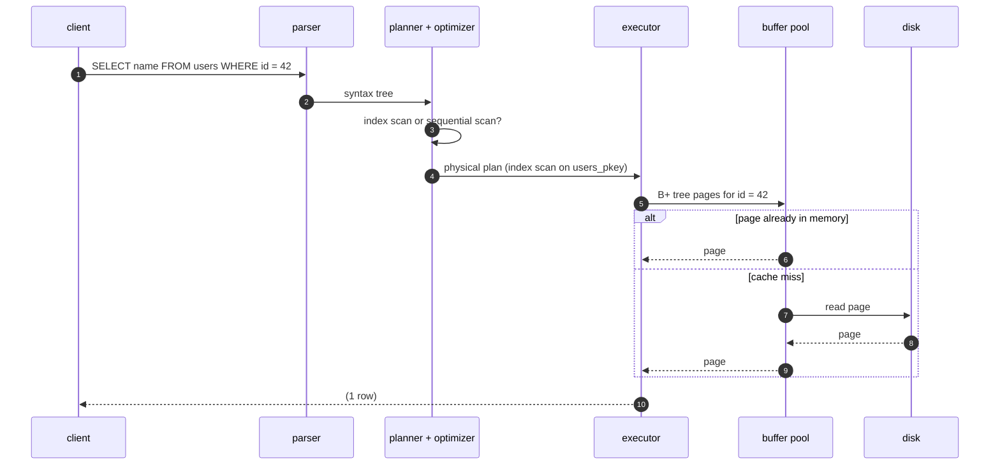
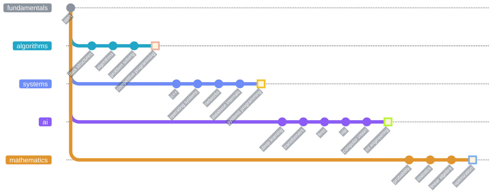
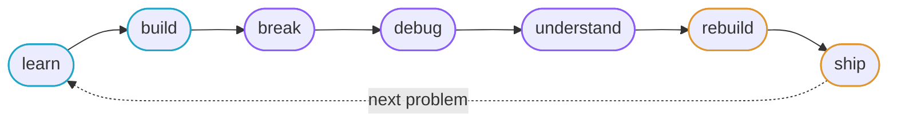

<div align="center">

<picture>
  <source media="(prefers-color-scheme: dark)" srcset="https://raw.githubusercontent.com/DeepakSkandh/DeepakSkandh/main/assets/header-dark.svg">
  <source media="(prefers-color-scheme: light)" srcset="https://raw.githubusercontent.com/DeepakSkandh/DeepakSkandh/main/assets/header-light.svg">
  
</picture>

<br><br>


<p>
  
</p>

<br><br>

<a href="#mindset"><kbd>&nbsp;mindset&nbsp;</kbd></a>&nbsp;
<a href="#interests"><kbd>&nbsp;interests&nbsp;</kbd></a>&nbsp;
<a href="#learning"><kbd>&nbsp;learning&nbsp;</kbd></a>&nbsp;
<a href="#from-scratch"><kbd>&nbsp;from scratch&nbsp;</kbd></a>&nbsp;
<a href="#philosophy"><kbd>&nbsp;philosophy&nbsp;</kbd></a>&nbsp;
<a href="#stack"><kbd>&nbsp;stack&nbsp;</kbd></a>&nbsp;
<a href="#exploring"><kbd>&nbsp;exploring&nbsp;</kbd></a>&nbsp;
<a href="#activity"><kbd>&nbsp;activity&nbsp;</kbd></a>&nbsp;
<a href="#connect"><kbd>&nbsp;connect&nbsp;</kbd></a>

</div>

<br>

## `~/mindset`

> [!IMPORTANT]
> **Don't just use the abstraction. Understand what's underneath it.**

Most of what I learn starts with a question an abstraction politely refuses to answer. Why is this query slow? Where does this tensor actually live? What happens between a request arriving and a response leaving? Every abstraction leaks eventually,[^leaky] and when it does, I want to already know what's underneath.

| when I use | I want to understand |
| :-- | :-- |
| a framework | its implementation |
| an API | the protocol beneath it |
| a database | its query engine |
| a model | its architecture, and how it is optimized |
| a library | the algorithm inside |
| any abstraction | the system it hides |

### one line, all the way down

<sub>Open a line to follow it through the layers.</sub>

<details>
<summary><code>SELECT name FROM users WHERE id = 42;</code></summary>
<br>



</details>

<details>
<summary><code>loss.backward()</code></summary>
<br>

Reverse-mode autodiff walks the computation graph backwards and multiplies local derivatives along the way:

$$
\frac{\partial \mathcal{L}}{\partial \theta} = \frac{\partial \mathcal{L}}{\partial y} \cdot \frac{\partial y}{\partial h} \cdot \frac{\partial h}{\partial \theta}
$$

```text
loss.backward()
 └─ traverse the autograd graph in reverse topological order
    └─ each op's backward() applies its local derivative
       └─ gradients accumulate into every leaf tensor's .grad
          └─ kernels launch on the GPU
             └─ often limited by memory bandwidth, not FLOPs
```

</details>

<details>
<summary><code>softmax(QKᵀ / √dₖ) V</code></summary>
<br>

$$
\mathrm{Attention}(Q, K, V) = \mathrm{softmax}\left(\frac{QK^{\top}}{\sqrt{d_k}}\right)V
$$

For a sequence of length $n$, the score matrix $QK^{\top}$ is $n \times n$, so naive attention costs $O(n^2 d)$ time and $O(n^2)$ memory. FlashAttention computes the exact same result in tiles that never write the full matrix to GPU memory, which is one reason long context windows became practical.

</details>

<details>
<summary><code>printf("hello\n");</code></summary>
<br>

```text
printf("hello\n");
 └─ formatted into a user-space stdio buffer
    └─ the newline flushes it: write(1, "hello\n", 6)
       └─ system call traps into the kernel
          └─ file descriptor 1 → tty driver
             └─ characters on a terminal
```

</details>

<br>

## `~/interests`

<picture>
  <source media="(prefers-color-scheme: dark)" srcset="https://raw.githubusercontent.com/DeepakSkandh/DeepakSkandh/main/assets/interests-dark.svg">
  <source media="(prefers-color-scheme: light)" srcset="https://raw.githubusercontent.com/DeepakSkandh/DeepakSkandh/main/assets/interests-light.svg">
  
</picture>

<br>

## `~/learning`

> [!NOTE]
> Every branch is open and nothing is merged. This is a record of direction, not a list of things I've finished.



<br>

## `~/from-scratch`

Things I want to build from scratch, because building something is the fastest way to find out what I didn't understand about it.

<picture>
  <source media="(prefers-color-scheme: dark)" srcset="https://raw.githubusercontent.com/DeepakSkandh/DeepakSkandh/main/assets/pipeline-dark.svg">
  <source media="(prefers-color-scheme: light)" srcset="https://raw.githubusercontent.com/DeepakSkandh/DeepakSkandh/main/assets/pipeline-light.svg">
  
</picture>

### the build list

<sub>Each box gets checked and linked to its repo when it ships.</sub>

- [ ] **minidb**: a database engine, from the parser down to crash recovery
- [ ] **autograd engine**: to see how backprop actually flows
- [ ] **transformer, no libraries**: to see what attention is really computing
- [ ] **memory allocator**: to see what `malloc` hides
- [ ] **HTTP server on raw sockets**: to see what a framework does per request
- [ ] **LSM-tree key-value store**: to see why writes are cheap and reads aren't
- [ ] **Raft**: to see how machines agree
- [ ] **thread pool**: to see what concurrency costs

### rules of engagement

```diff
- consume the system
+ build the system

- memorize the API
+ understand the implementation

- assume it's fast
+ benchmark it

- guess
+ debug

- stop at "it works"
+ ask why it works
```

<br>

## `~/philosophy`



> **Understand** before abstracting.
>
> **Measure** before optimizing.
>
> **Build** before overengineering.
>
> **Read the source** when the abstraction stops making sense.

<br>

## `~/stack`

| layer | tools |
| :-- | :-- |
| **languages** |  &nbsp; `SQL` `MATLAB` |
| **ai / ml** |  &nbsp; `Keras` `Hugging Face` |
| **data** | `NumPy` `Pandas` `SciPy` `Matplotlib` `Seaborn` `RDKit` |
| **databases** |  |
| **tooling** |  |

<br>

## `~/exploring`

```text
$ ps -eo pid,stat,cmd --sort=curiosity

  PID  STAT  CMD
  101  R     cpp-systems          --memory-model --performance
  102  R     database-internals   --storage --query-execution
  103  R     distributed-systems  --consensus --replication
  104  R     llm-engineering      --inference --evaluation
  105  R     competitive-prog     --contests --upsolving
  106  R     backend-engineering  --apis --concurrency
  107  R     hpc                  --parallelism --cache-locality
  108  R     ml-systems           --training --serving
```

<br>

## `~/activity`

<picture>
  <source media="(prefers-color-scheme: dark)" srcset="https://raw.githubusercontent.com/DeepakSkandh/DeepakSkandh/main/assets/generated/stats-dark.svg">
  <source media="(prefers-color-scheme: light)" srcset="https://raw.githubusercontent.com/DeepakSkandh/DeepakSkandh/main/assets/generated/stats-light.svg">
  
</picture>

<picture>
  <source media="(prefers-color-scheme: dark)" srcset="https://raw.githubusercontent.com/DeepakSkandh/DeepakSkandh/main/assets/generated/snake-dark.svg">
  <source media="(prefers-color-scheme: light)" srcset="https://raw.githubusercontent.com/DeepakSkandh/DeepakSkandh/main/assets/generated/snake-light.svg">
  
</picture>

### `~/log`

<sub>Recent public activity, rewritten daily by a workflow in this repo.</sub>

<!-- LOG:START -->
```text
$ git log --author="DeepakSkandh" --all --oneline -n 8
  (waiting for the first sync)
```
<!-- LOG:END -->

<br>

## `~/connect`

<div align="center">

<a href="https://github.com/DeepakSkandh"><kbd>&nbsp;github&nbsp;</kbd></a>&nbsp;
<a href="mailto:deepakskandh"><kbd>&nbsp;email&nbsp;</kbd></a>&nbsp;


<br><br>

<picture>
  <source media="(prefers-color-scheme: dark)" srcset="https://raw.githubusercontent.com/DeepakSkandh/DeepakSkandh/main/assets/footer-dark.svg">
  <source media="(prefers-color-scheme: light)" srcset="https://raw.githubusercontent.com/DeepakSkandh/DeepakSkandh/main/assets/footer-light.svg">
  
</picture>


</div>

[^leaky]: Joel Spolsky named this the Law of Leaky Abstractions in 2002: every non-trivial abstraction eventually exposes some of the detail it was built to hide.
