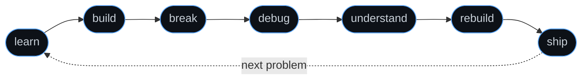

<div align="center">

<br>

# Deepak Skandh

**AI &nbsp;×&nbsp; Systems &nbsp;×&nbsp; Engineering**

<p><i>"Every abstraction is a promise. I read the fine print."</i></p>


<br>

<!-- Replace with a suitable developer GIF -->
 

<sub>building, breaking, and understanding things from the inside out.</sub>

<br><br>

<a href="#mindset">mindset</a> &nbsp;·&nbsp;
<a href="#interests">interests</a> &nbsp;·&nbsp;
<a href="#learning">learning</a> &nbsp;·&nbsp;
<a href="#from-scratch">from scratch</a> &nbsp;·&nbsp;
<a href="#philosophy">philosophy</a> &nbsp;·&nbsp;
<a href="#stack">stack</a> &nbsp;·&nbsp;
<a href="#exploring">exploring</a> &nbsp;·&nbsp;
<a href="#activity">activity</a> &nbsp;·&nbsp;
<a href="#connect">connect</a>

</div>

<br>

## `~/mindset`

<sub>don't just use the abstraction. understand what's underneath it.</sub>

Most of what I learn starts with a question an abstraction politely refuses to answer. Why is this query slow? Where does this tensor actually live? What does a framework do between a request arriving and a response leaving? I'd rather open the box than memorize its labels.

| the abstraction | what I want to see underneath |
| :-- | :-- |
| `framework` | the implementation |
| `API` | the protocol |
| `database` | the query engine |
| `model` | the architecture and the optimization |
| `library` | the algorithm |
| `abstraction` | the system beneath it |

**one line, all the way down**

<details>
<summary><code>SELECT * FROM users WHERE id = 42;</code></summary>

```text
SELECT * FROM users WHERE id = 42;
 └─ tokenized and parsed into an AST
    └─ planner weighs index scan vs. sequential scan
       └─ B+ tree traversal → page id
          └─ buffer pool hit? otherwise read from disk
             └─ tuple decoded → row returned
```

</details>

<details>
<summary><code>loss.backward()</code></summary>

```text
loss.backward()
 └─ walk the computation graph in reverse
    └─ apply the chain rule at every node
       └─ accumulate gradients into .grad tensors
          └─ launch matmul / elementwise kernels on the GPU
             └─ often limited by memory bandwidth, not FLOPs
```

</details>

<details>
<summary><code>printf("hello\n");</code></summary>

```text
printf("hello\n");
 └─ formatted into a user-space stdio buffer
    └─ newline flushes it → write() system call
       └─ trap into the kernel
          └─ file descriptor → tty driver
             └─ characters on a terminal
```

</details>

<br>

## `~/interests`

<sub>four questions I keep coming back to</sub>

<table>
<tr>
<td width="25%" valign="top">
<b>🧠 intelligence</b><br>
<sub><i>why does it generalize?</i></sub>
<br><br>
artificial intelligence<br>
machine learning<br>
deep learning<br>
LLMs · generative AI<br>
NLP<br>
computer vision
</td>
<td width="25%" valign="top">
<b>⚙️ systems</b><br>
<sub><i>where does the time go?</i></sub>
<br><br>
backend engineering<br>
database systems<br>
distributed systems<br>
high-performance computing<br>
systems engineering<br>
automation
</td>
<td width="25%" valign="top">
<b>🧮 foundations</b><br>
<sub><i>what does it cost?</i></sub>
<br><br>
algorithms<br>
data structures<br>
competitive programming<br>
probability<br>
statistics
</td>
<td width="25%" valign="top">
<b>🔬 science</b><br>
<sub><i>what does the data say?</i></sub>
<br><br>
data science<br>
computational biology<br>
research<br>
experimentation
</td>
</tr>
</table>

<br>

## `~/learning`

<sub>in progress. nothing here is marked done.</sub>

<table>
<tr>
<td width="50%" valign="top">

```text
algorithms/
├── data-structures
├── algorithms
├── problem-solving
└── competitive-programming

mathematics/
├── probability
├── statistics
├── linear-algebra
└── optimization
```

</td>
<td width="50%" valign="top">

```text
systems/
├── c++
├── operating-systems
├── computer-networks
├── database-internals
└── systems-programming

ai/
├── deep-learning
├── transformers
├── llms
├── nlp
├── computer-vision
└── ml-engineering
```

</td>
</tr>
</table>

<sub><code>4 directories · 19 topics · 0 marked "done"</code></sub>

<br><br>

## `~/from-scratch`

<sub>things i want to build from scratch, because building is how I find out what I didn't understand.</sub>

```text
# target: a database engine, one layer at a time

  query
    ↓
  parser              text → tokens → AST
    ↓
  query planner       AST → logical plan
    ↓
  optimizer           cost model → physical plan
    ↓
  execution engine    iterators · joins · aggregation
    ↓
  storage engine      pages · buffer pool · heap files
    ↓
  indexes             B+ trees · hash indexes
    ↓
  transactions        ACID · isolation levels
    ↓
  concurrency         locking · MVCC
    ↓
  recovery            write-ahead log · checkpoints
```

<details>
<summary><b>more on the list</b></summary>

```text
autograd engine          → how backprop actually flows
transformer, no libs     → what attention is really computing
memory allocator         → what malloc hides
http server on sockets   → what a framework does per request
key-value store (LSM)    → why writes are cheap and reads aren't
raft consensus           → how machines agree
thread pool              → what concurrency costs
```

</details>

**rules of engagement**

```diff
- consume the system
+ build the system

- memorize the API
+ understand the implementation

- assume it's fast
+ benchmark it

- guess
+ debug

- stop at "it works"
+ ask why it works
```

<br>

## `~/philosophy`

<sub>the loop</sub>



> **Understand** before abstracting.
>
> **Measure** before optimizing.
>
> **Build** before overengineering.
>
> **Read the source** when the abstraction stops making sense.

<br>

## `~/stack`

<sub>the tools, not the point</sub>

<table>
<tr>
<td width="18%"><b>languages</b></td>
<td> &nbsp; <code>SQL</code> <code>MATLAB</code></td>
</tr>
<tr>
<td><b>ai / ml</b></td>
<td> &nbsp; <code>Keras</code> <code>Hugging Face</code></td>
</tr>
<tr>
<td><b>data</b></td>
<td><code>NumPy</code> <code>Pandas</code> <code>SciPy</code> <code>Matplotlib</code> <code>Seaborn</code> <code>RDKit</code></td>
</tr>
<tr>
<td><b>databases</b></td>
<td></td>
</tr>
<tr>
<td><b>tools</b></td>
<td></td>
</tr>
</table>

<br>

## `~/exploring`

<sub>directions currently holding my attention</sub>

```text
$ ps -eo pid,stat,cmd --sort=curiosity

  PID  STAT  CMD
  101  R     cpp-systems          --memory-model --performance
  102  R     database-internals   --storage --query-execution
  103  R     distributed-systems  --consensus --replication
  104  R     llm-engineering      --inference --evaluation
  105  R     competitive-prog     --contests --upsolving
  106  R     backend-engineering  --apis --concurrency
  107  R     hpc                  --parallelism --cache-locality
  108  R     ml-systems           --training --serving
```

<br>

## `~/activity`

<sub>proof of work</sub>

<div align="center">

<picture>
  <source media="(prefers-color-scheme: dark)" srcset="https://github-readme-stats.vercel.app/api?username=YOUR_GITHUB_USERNAME&show_icons=true&hide_border=true&theme=github_dark&include_all_commits=true" />
  
</picture>
<picture>
  <source media="(prefers-color-scheme: dark)" srcset="https://github-readme-stats.vercel.app/api/top-langs/?username=YOUR_GITHUB_USERNAME&layout=compact&langs_count=6&hide_border=true&theme=github_dark" />
  
</picture>

<picture>
  <source media="(prefers-color-scheme: dark)" srcset="https://streak-stats.demolab.com?user=YOUR_GITHUB_USERNAME&theme=dark&hide_border=true" />
  
</picture>

</div>

<details>
<summary><b>contribution activity</b></summary>
<br>


</details>

<br>

## `~/connect`

<div align="center">

[`github`](https://github.com/Deepakskandh) &nbsp;·&nbsp;

[`email`](mailto:deepakskandh@gmail.com) &nbsp;·&nbsp;


<br>


<br><br>

<sub><code>// still compiling.</code></sub>

</div>
